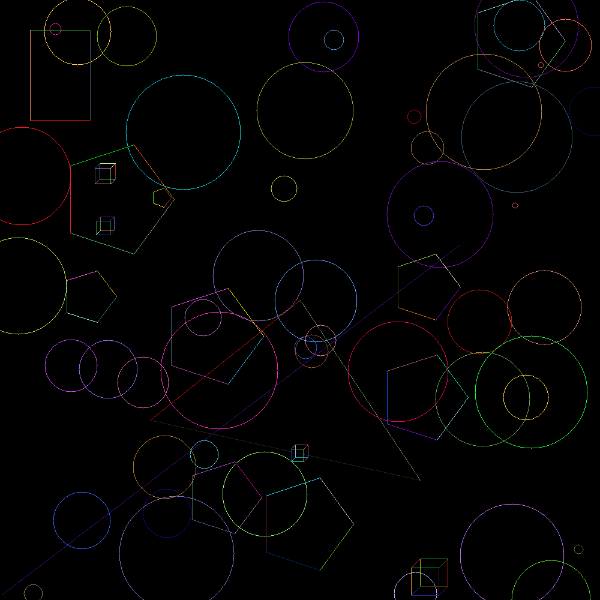

# Drawing Shapes with Rust

This project is a Rust implementation for drawing various geometric shapes onto an image canvas. It demonstrates the use of traits, structs, and image manipulation to create a visual representation of points, lines, triangles, rectangles, and circles.

## Features

- Draw multiple geometric shapes with random colors
- Includes implementations for:
  - Points
  - Lines (using Bresenham's algorithm)
  - Triangles
  - Rectangles
  - Circles (using midpoint circle algorithm)
- Random shape generation within canvas bounds
- Image output in PNG format

## Requirements

- Rust (latest stable version recommended)
- Cargo (Rust's package manager)

## Dependencies

This project uses the following crates:
- `raster` for image manipulation
- `rand` for random number generation

## Installation

1. Clone the repository:
   ```bash
   git clone https://github.com/Athooh/drawable.git
   cd drawing
   ```

2. Build the project:
   ```bash
   cargo build
   ```

## Usage

Run the program with:
```bash
cargo run
```

This will generate an image file named `image.png` in the project directory containing randomly drawn shapes.

## Project Structure

- `main.rs`: The main entry point that sets up the canvas and draws shapes
- `geometrical_shapes.rs`: Contains all shape implementations and traits
  - Implements `Drawable` and `Displayable` traits
  - Provides shape structs: `Point`, `Line`, `Triangle`, `Rectangle`, `Circle`
  - Includes random generation methods for some shapes

## Implementation Details

### Traits

1. `Drawable`: Defines common behavior for drawable shapes
   - `draw(&self, image: &mut Image)`: Draws the shape on the image
   - `color(&self) -> Color`: Returns the shape's color

2. `Displayable`: Implemented for `Image` to handle pixel display
   - `display(&mut self, x: i32, y: i32, color: Color)`: Sets a pixel's color

### Shapes

Each shape implements the `Drawable` trait and provides:
- A `new()` constructor
- For some shapes, a `random()` generator that creates shapes within given bounds

## Example Output

The program generates an image with:
- 1 random line
- 1 random point
- 1 defined rectangle
- 1 defined triangle
- 50 random circles



## Extending the Project

To add more shapes:
1. Create a new struct in `geometrical_shapes.rs`
2. Implement the `Drawable` trait
3. Add constructor methods
4. Use it in `main.rs`

## License

This project is open-source and available under the MIT License.